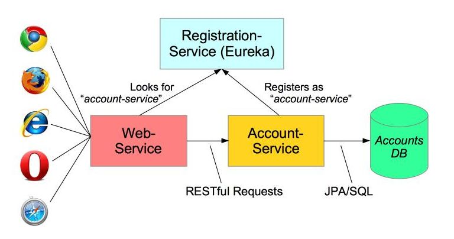

# Run Using Docker

We are going to run the Accounts Microservice application available at https://github.com/paulc4/microservices-demo using three docker containers, one for the Eureka registration server and one for each microservice.

## Build the Image

1. Fetch the code using git clone `https://github.com/paulc4/microservices-demo`

1. Build using either `mvn package` or `gradle assemble` as you prefer.

   This will create the jar: `target/microservices-demo-1.2.0.RELEASE.jar`

1. Here is the Dockerfile:

    ```sh
    FROM openjdk:8-jre
    ADD target/microservices-demo-1.2.0.RELEASE.jar app.jar
    EXPOSE 1111
    EXPOSE 2222
    EXPOSE 3333
    ```

    What this does:

    * Use the OpenJDK 8 docker image (freely available at Docker hub) as a starting point. This image defines a minimal Linux system with OpenJDK 8 preinstalled.
    * Copy the demo jar into the container and rename it to `app.jar` to save typing later.  By default, `app.jar` will be copied into the root of the container file system.
    * Expose ports 1111, 2222 and 3333.

1. To build the container (**note** the `.` at the end, indicating to use the current directory as its working directory):

    ```sh
    docker build -t paulc4/microservice .
    ```

1. Check it worked. You should see `paulc4/microservice` listed.

    ```sh
    docker images
    ```

## Running the Application

We will run the container three times, each time running the Java application in a different mode.



1. They need to talk to each other, so let's give them a network:

    ```sh
    docker network create accounts-net
    ```

1. Now run the first container. This runs up the Eureka registration server, which will allow the other microservices to find each other:

    ```sh
    docker run --name reggo --hostname reggo --network accounts-net -p 1111:1111 paulc4/microservice java -jar app.jar reg
    ```

    The `-d` (detach) flag is missing so all output will stream to the console so we can see what is happening.
    
    As soon as the application starts up, it displays its IP address. Remember this for later.

1. In your browser, go to http://localhost:1111 and you should see the Eureka dashboard. There are no instances registered.

1. _In a new CMD/Terminal window_, run a second container for the accounts microservice. This holds a database if 21 available accounts (stored using the H2 in-memory RDBMS database)

    ```sh
    docker run --name accounts --hostname accounts --network accounts-net -p 2222:2222 paulc4/microservice java -jar app.jar accounts  --registration.server.hostname=<reg server ip addr>
    ```

    Replace `<eg server ip addr>` with the IP address you determined earlier.

1. Return to the Eureka Dashboard in your browser and refresh the screen.  You should see that `ACCOUNTS-SERVICE` is now registered.

1. _In a new CMD/Terminal window_, run a third container for the accounts web-service. This is a web-application for viewing account information by requesting account data from the accounts microservice.

    ```sh
    docker run --name web --hostname web --network accounts-net -p 3333:3333 paulc4/microservice java -jar app.jar web --registration.server.hostname=<eg server ip addr>
    ```

    Replace `<eg server ip addr>` with the IP address you determined earlier.

1. Return to the Eureka Dashboard in your browser and refresh the screen.  You should see that `ACCOUNTS-SERVICE` and `WEB-SERVICE` are now registered.

1. In a second browser tab, go to http://localhost:3333.  This is the web interface you just deployed and you should be able to view, list and search for account information.
